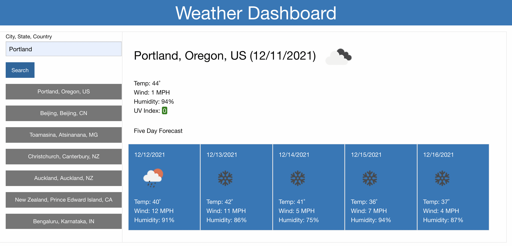

# ⛈ weather-dashboard
This is a simple weather application that calls the OpenWeather API to return a 5 day forecast for a user-defined location.

## Libraries Used
* jQuery
* moment.js
* Foundation

## APIs Called
* Open Weather
    * Geocoding
    * One Call

## Description

This app calls the Open Weather API given a user's city input and displays the current weather, plus a five-day forecast. The user's last searched city is saved in localStorage, as well as their search history in convenient search buttons.

## Setup
* Clone the repo
* Open index.html in your browser

## Deployment
This app is deployed using GitHub pages at this link: [https://jmichaelbrown8.github.io/weather-dashboard/](https://jmichaelbrown8.github.io/weather-dashboard/)

